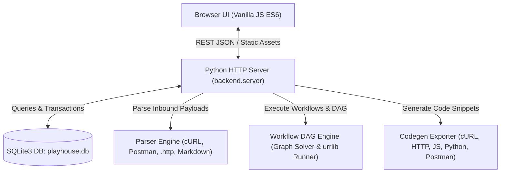

# 🏗️ Architecture Design & Specification

## System Overview

## Component Breakdown

### 1. Zero-Dependency Storage (`backend/storage/db.py`)
- Standard library `sqlite3`.
- Schemas:
  - `environments`: Holds active and inactive variable dictionaries.
  - `collections`: Groups related APIs into testable suites.
  - `requests`: Detailed API specifications including headers, body, and extraction rules.
  - `history`: Historical execution timestamps, status codes, elapsed durations, and response logs.

### 2. Universal Parser Engine (`backend/parsers/`)
- `curl_parser.py`: Decodes flags (`-X`, `-H`, `-d`, `--data-raw`, `-u`, URLs).
- `postman_parser.py`: Parses Postman collection v2.0/v2.1 schemas, extracts variables and tests.
- `http_file_parser.py`: Ingests RFC 7230 `.http` and `.rest` files with `###` block separators.
- `markdown_parser.py`: Scans markdown files for embedded code blocks (`curl`, `http`, `bash`).

### 3. Game Workflow & DAG Engine (`backend/engine/`)
- `interpolator.py`: Injects `{{variable}}` and handles dynamic macros like `{{$timestamp}}`, `{{$guid}}`.
- `extractor.py`: Parses response JSON bodies (dot notation `data.token`), headers, status codes, and regex into environment variables.
- `dependency_graph.py`: Builds a Directed Acyclic Graph (DAG) by matching produced variables (tokens, IDs) to consumer endpoints. Automatically determines if an API belongs to:
  1. *Authentication & Session* (Tier 0)
  2. *Player & Character Setup* (Tier 1)
  3. *Gameplay & Mechanics* (Tier 2)
  4. *Leaderboard & Scoring* (Tier 3)
- `executor.py`: Pure Python standard library `urllib.request` runner supporting all HTTP methods, timeouts, custom SSL verification, and sub-millisecond timing.

### 4. Modular Frontend Architecture (`frontend/js/modules/`)
- Single responsibility modules grouped by domain:
  - `api_client.js`: Asynchronous REST fetch gateway.
  - `env/env_manager.js`: Environment selector and JSON variable vault.
  - `explorer/explorer.js`: Searchable sidebar for collections and endpoints.
  - `studio/studio.js`: Multi-view request editor, code generator, and response inspector.
  - `workflow/workflow.js`: Interactive quest pipeline visualizer and runner.
  - `importer/importer.js`: Modal for pasting commands or uploading definitions.
  - `exporter/exporter.js`: Modal for exporting single or batched APIs into 5 formats.
  - `house/house_manager.js`: Auto-architect engine and HUD vitals monitor.
  - `trophies/trophy_manager.js`: Gamified achievement evaluator and modal viewer.
  - `coop/coop_manager.js`: Local multiplayer live event ticker.
  - `replay/replay_manager.js`: Interactive time-travel execution scrubber and tape exporter.
  - `docs/doc_manager.js`: Auto-documentation generator and markdown viewer.
  - `advisor/advisor_manager.js`: Strategy advisor and multi-way test matrix runner.
  - `realtime/realtime_studio.js`: Live WebSocket and Server-Sent Events traffic studio.
  - `docs_hub/docs_hub.js`: In-app developer knowledge hub, setup guides, and live markdown documentation reader.

### 5. Chaos Monkey Engine (`backend/chaos/`)
- Injects latency, 429 rate-limiting, and 500 server crashes to test client resilience during Boss Enrage mode.

### 6. Sandbox Mock Server (`backend/sandbox/`)
- Zero-backend dynamic game simulation under `/mock/*` returning tokens, characters, and loot drops.

### 7. Headless CI Runner (`backend/cli/`)
- Direct command-line execution (`python3 app.py --cli`) evaluating House HP against threshold targets for CI/CD gates.

### 8. Fuzzing & Side Quests (`backend/fuzzer/`)
- Generates automated boundary stress tests (*Ghost Attack*, *Armor Pierce*, *Overclock Sprint*).

### 9. Time-Travel Replay (`backend/replay/`)
- Frame checkpoint recorder and exportable replay tapes for deterministic bug reproduction.

### 10. Trophies & Gamification (`backend/trophies/`)
- Real-time achievement evaluator awarding developer XP and badges based on test performance.

### 11. Auto-Documentation Generator (`backend/docs_generator/`)
- Auto-extracts parameters, headers, schema models, status codes, and QA checklists into GitHub Markdown.

### 12. Test Strategy Advisor (`backend/advisor/`)
- Inspects endpoints and calculates the exact count of critical test scenarios (6-8 dimensions) and grades each execution.

### 13. In-App Knowledge & Setup Hub (`frontend/index.html` & `backend/server.py`)
- Provides immediate developer onboarding: server quickstart commands, CI flags, Game House architectural guides, REST API reference tables, and interactive live markdown viewer for repository documentation.

### 14. Contributor CI & Branching Architecture (`.github/` & `CONTRIBUTING.md`)
- Automated multi-version GitHub Actions CI test matrix enforcing the zero-dependency standard library constraint, headless CLI quest runner threshold (`--min-hp 70`), and HTML syntax validation across all PRs.
- Feature-branch workflow (`feat/`, `fix/`, `docs/`, `refactor/`, `test/`) with protected `main` branch and conventional commit standards.

