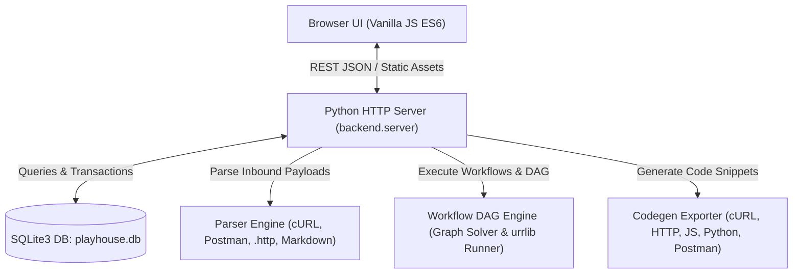

# 🏗️ Architecture Design & Specification

## System Overview

## Component Breakdown

### 1. Zero-Dependency Storage (`backend/storage/db.py`)
- Standard library `sqlite3`.
- Schemas:
  - `environments`: Holds active and inactive variable dictionaries.
  - `collections`: Groups related APIs into testable suites.
  - `requests`: Detailed API specifications including headers, body, and extraction rules.
  - `history`: Historical execution timestamps, status codes, elapsed durations, and response logs.

### 2. Universal Parser Engine (`backend/parsers/`)
- `curl_parser.py`: Decodes flags (`-X`, `-H`, `-d`, `--data-raw`, `-u`, URLs).
- `postman_parser.py`: Parses Postman collection v2.0/v2.1 schemas, extracts variables and tests.
- `http_file_parser.py`: Ingests RFC 7230 `.http` and `.rest` files with `###` block separators.
- `markdown_parser.py`: Scans markdown files for embedded code blocks (`curl`, `http`, `bash`).

### 3. Game Workflow & DAG Engine (`backend/engine/`)
- `interpolator.py`: Injects `{{variable}}` and handles dynamic macros like `{{$timestamp}}`, `{{$guid}}`.
- `extractor.py`: Parses response JSON bodies (dot notation `data.token`), headers, status codes, and regex into environment variables.
- `dependency_graph.py`: Builds a Directed Acyclic Graph (DAG) by matching produced variables (tokens, IDs) to consumer endpoints. Automatically determines if an API belongs to:
  1. *Authentication & Session* (Tier 0)
  2. *Player & Character Setup* (Tier 1)
  3. *Gameplay & Mechanics* (Tier 2)
  4. *Leaderboard & Scoring* (Tier 3)
- `executor.py`: Pure Python standard library `urllib.request` runner supporting all HTTP methods, timeouts, custom SSL verification, and sub-millisecond timing.

### 4. Modular Frontend Architecture (`frontend/js/modules/`)
- Single responsibility modules grouped by domain:
  - `api_client.js`: Asynchronous REST fetch gateway.
  - `env/env_manager.js`: Environment selector and JSON variable vault.
  - `explorer/explorer.js`: Searchable sidebar for collections and endpoints.
  - `studio/studio.js`: Multi-view request editor, code generator, and response inspector.
  - `workflow/workflow.js`: Interactive quest pipeline visualizer and runner.
  - `importer/importer.js`: Modal for pasting commands or uploading definitions.
  - `exporter/exporter.js`: Modal for exporting single or batched APIs into 5 formats.
